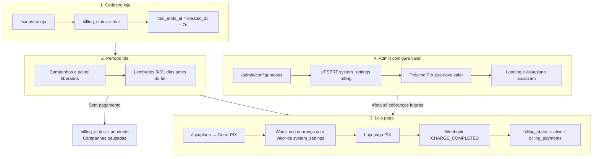
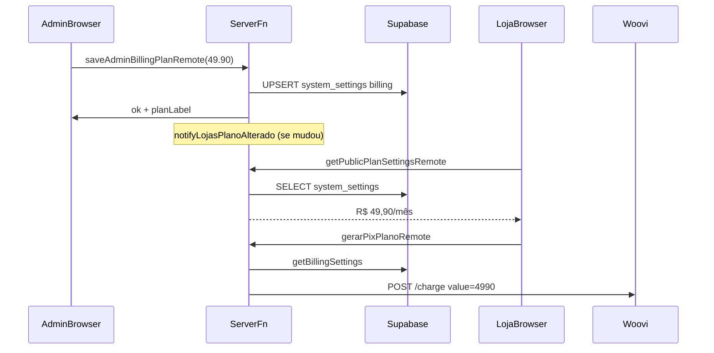
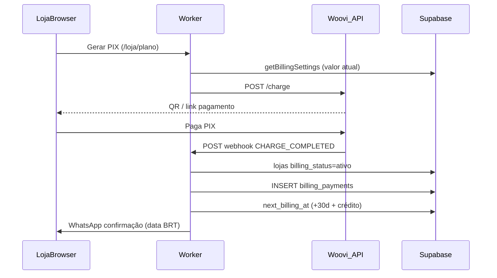

# Especificação completa — Billing e pagamento do plano loja

> **Documento único e portável** para implementar ou replicar o módulo de cobrança SaaS do IndicaAí em outro projeto.  
> Consolida `BILLING.md` + partes de pagamento de `ADMIN.md` e `ESPECIFICACAO-PAINEL-ADMIN-ERP.md`.  
> **Não inclui** configuração de WhatsApp/Evolution do admin — apenas **pagamento, plano, PIX e painel admin de billing**.

Idioma: português (Brasil). Datas: ISO `AAAA-MM-DD`, fuso **`America/Sao_Paulo`**.

**Referência de código:** repositório IndicaAí (exemplos concretos). **Não reutilize** domínio, AppID, webhook secret nem credenciais Woovi do IndicaAí — use o **domínio e o banco do sistema que você está implementando**.

---

## 1. O que este módulo faz

Cobrança do **plano mensal da loja**:

- Trial gratuito **no cadastro**
- Assinatura via **PIX** (Woovi/OpenPix)
- Admin define o **valor do plano** em `/admin/configuracoes` → grava no **Supabase** → próximas cobranças e telas usam o valor novo
- Webhook confirma pagamento → ativa plano, histórico, renovação +30 dias
- Cron diário para lembretes e inadimplência
- Pausa automática de campanhas quando o plano vence sem pagamento

**Fora de escopo:** repasse de comissão loja → parceiro.

---

## 2. Adaptação obrigatória — domínio, schema e nomes de tabelas

Tudo que aparece neste documento com **nomes do IndicaAí** (`indicaaí.com`, schema `indicaai`, tabela `lojas`, etc.) é **exemplo de referência**. No **seu sistema**, substitua pelo equivalente do **projeto em que você está implementando**.

### 2.1 Domínio e URLs (webhook, cron, links públicos)

| Conceito | IndicaAí (exemplo) | No seu sistema |
| --- | --- | --- |
| Domínio público | `https://indicaaí.com` | **`https://{SEU_DOMINIO}`** — o domínio onde o app está em produção |
| Webhook Woovi | `POST https://indicaaí.com/api/webhooks/woovi` | **`POST https://{SEU_DOMINIO}/api/webhooks/woovi`** (ou o path que o seu app expuser) |
| Cron billing | `GET https://{SEU_DOMINIO}/api/cron/billing` | Mesma base: **seu domínio** + rota do cron |
| `PUBLIC_APP_URL` (env) | URL canônica do app | **Igual ao domínio público do seu deploy** — usado em links de e-mail/WhatsApp |

**Regra:** ao cadastrar o webhook no painel Woovi/OpenPix, a URL **sempre** usa o **domínio do sistema que você está configurando**, nunca o domínio do IndicaAí (a menos que você esteja mantendo o próprio IndicaAí).

O **caminho** (`/api/webhooks/woovi`, `/api/cron/billing`) pode ser o mesmo da referência IndicaAí ou adaptado — o importante é que o Worker/servidor do **seu** projeto responda nessa URL.

### 2.2 Schema, tabelas e entidades (formato × nome)

| Conceito IndicaAí | Pode chamar no seu ERP | O que **não** muda (formato / atributos) |
| --- | --- | --- |
| Schema `indicaai` | `erp`, `app`, `public`, etc. | Tabelas versionadas em migrations SQL |
| Tabela `lojas` | `companies`, `tenants`, `clientes`, `filiais` | Campos de billing: `billing_status`, `trial_ends_at`, `next_billing_at`, `last_payment_at`, … |
| Tabela `billing_payments` | `subscription_payments`, `pix_payments` | `loja_id` (FK da entidade), `paid_at`, `value_cents`, `correlation_id`, `end_to_end_id`, idempotência webhook |
| Tabela `system_settings` | `settings`, `global_config` | Chave `billing` + JSON `{ "plan_value_cents": N }` |
| Coluna `pausado_por_billing` em campanhas | equivalente na entidade de “oferta/campanha” | Boolean que separa pausa manual de pausa por billing |

**Regra:** o **nome** da tabela/schema é livre; a **estrutura** (tipos, colunas, chaves, fluxos) deve seguir esta especificação para o billing funcionar igual.

### 2.3 Credenciais Woovi

Cada sistema/produto tem **sua própria** conta Woovi, **seu** `WOOVI_APP_ID`, **seu** `WOOVI_WEBHOOK_AUTHORIZATION` e **seu** webhook apontando para **seu** domínio. Não copiar credenciais nem URL de produção de outro projeto.

### 2.4 Rotas de UI (prefixos)

Rotas como `/admin/configuracoes`, `/loja/plano` são do IndicaAí. No outro ERP podem ser `/backoffice/settings`, `/empresa/assinatura`, etc. — desde que existam telas equivalentes com o **mesmo comportamento** descrito nas seções 6, 8 e 9.

---

## 3. Resumo comercial

| Item | Valor (IndicaAí) |
| --- | --- |
| Trial | **7 dias** grátis no cadastro (`BILLING_TRIAL_DAYS`) |
| Plano padrão | **R$ 39,90/mês** (`BILLING_PLAN_VALUE_CENTS = 3990`) — **admin pode alterar** |
| Meio | PIX (Woovi/OpenPix) |
| Renovação | **+30 dias** após cada pagamento (+ crédito se pagou antes do vencimento) |
| Lembretes | WhatsApp **5, 3 e 1** dia(s) antes do vencimento |
| Landing `/` | Exibe trial + valor mensal lidos de `system_settings` |

> Trial **não** é configurável no painel admin hoje — só em `src/lib/billing/constants.ts`.

---

## 4. Fluxo completo (visão geral)



---

## 5. Cadastro da loja — nasce com plano trial

**Rota:** `/cadastro/loja`  
**Server:** `registerLojaWithAuth` em `src/lib/api/auth.functions.ts`  
**Helper:** `billingFieldsForNewLoja()` em `src/lib/billing/fields.ts`

| Campo Supabase (`lojas`) | Valor na criação |
| --- | --- |
| `billing_status` | `trial` |
| `trial_ends_at` | `created_at` + 7 dias |
| `next_billing_at` | igual ao fim do trial |
| `status` | `ativo` (operacional — loja pode logar) |

Durante o trial a loja usa o sistema normalmente. Lembretes WhatsApp saem 5, 3 e 1 dia(s) antes de `trial_ends_at`.

---

## 6. Admin — configurar valor do plano (eixo central)

### 6.1 Tela

| Item | Detalhe |
| --- | --- |
| URL | `/admin/configuracoes` |
| Campo | «Valor do plano (R$/mês)» |
| UI | `src/routes/admin.configuracoes.tsx` |
| Botão | **Salvar plano** → `saveAdminBillingPlanRemote` |

O admin **não** edita Supabase manualmente no dia a dia — a tela grava tudo via server function com **service role**.

### 6.2 O que acontece ao salvar

1. Admin informa valor em reais (ex.: `49,90`).
2. Servidor converte: `newCents = Math.round(planValueReais * 100)` → `4990`.
3. **`UPSERT`** em `{schema}.system_settings` (no IndicaAí: `indicaai.system_settings`):
   - `key = 'billing'`
   - `value = { "plan_value_cents": 4990 }`
4. Se o valor **mudou** → `notifyLojasPlanoAlterado(old, new)` envia WhatsApp a todas as lojas ativas avisando que o novo valor vale na **próxima cobrança**.
5. **Pagamentos já confirmados** em `billing_payments` **não** são alterados.
6. **Próxima cobrança PIX** (`createWooviPlanCharge`) chama `getPlanValueCentsForCharge()` → lê `system_settings` na hora.
7. **Landing** (`/`) e **`/loja/plano`** exibem o valor via `getPublicPlanSettingsRemote` / `usePublicPlan`.
8. **Dashboard admin** usa o valor atual para estimar «a receber» e ticket médio.

### 6.3 Código (referência IndicaAí)

| Caminho | Função |
| --- | --- |
| `src/lib/admin/system-settings.server.ts` | `getBillingSettings()`, `setBillingPlanValueCents()` |
| `src/lib/admin/plan-notify.server.ts` | `getPlanValueCentsForCharge()`, `notifyLojasPlanoAlterado()` |
| `src/lib/api/admin.functions.ts` | `getAdminSettingsRemote`, `saveAdminBillingPlanRemote` |
| `src/lib/billing/woovi/charge.server.ts` | `createWooviPlanCharge` usa valor do banco |
| `src/lib/billing/constants.ts` | Fallback `BILLING_PLAN_VALUE_CENTS = 3990` se DB vazio |

### 6.4 Fallback

Se `system_settings` não existir ou `plan_value_cents` for inválido → usa `BILLING_PLAN_VALUE_CENTS` do código.

### 6.5 Diagrama — alterar valor do plano



---

## 7. Status de pagamento (`lojas.billing_status`)

| Valor | Significado |
| --- | --- |
| `trial` | Período gratuito inicial (7 dias após cadastro) |
| `ativo` | Plano em dia após pagamento confirmado |
| `pendente` | Trial expirou ou plano suspenso sem pagamento |
| `inadimplente` | Atraso após cron/lembretes |

### Regras de transição

1. **Cadastro** → `trial`, `trial_ends_at = created_at + 7 dias`.
2. **Trial sem pagamento** (cron) → `pendente`; campanhas ativas → `pausado` com `pausado_por_billing = true`.
3. **Webhook pagamento** → `ativo`, `next_billing_at`, linha em `billing_payments`, reativa campanhas pausadas **só** por billing.
4. **Reembolso confirmado** → pagamento `reembolsado`, plano `pendente`, campanhas pausadas por billing.

### Separação importante: loja pausada × plano

| Campo | Controle |
| --- | --- |
| `lojas.status` | Operacional (`ativo` / `inativo`) — admin pausa loja manualmente |
| `lojas.billing_status` | Pagamento do plano |

Uma loja pode ter **`billing_status = ativo`** e **`status = inativo`** (pausada pelo admin). São independentes.

---

## 8. Painel admin — telas de pagamento

### 8.1 Rotas (somente billing)

| URL | Função |
| --- | --- |
| `/admin/configuracoes` | **Configurar valor do plano** (campo principal deste doc) |
| `/admin/dashboard` | Receita no período, lojas com plano ativo/pendente |
| `/admin/lojas` | Listagem com badge de `billing_status` |
| `/admin/lojas/$lojaId` | Resumo billing + **Pagamentos do plano** + estorno sugerido |

### 8.2 Dashboard — receita no período

- Filtro **De / Até** (`YYYY-MM-DD`, BRT); padrão = mês corrente.
- **Receita** = soma de `billing_payments` com `paid_at` no intervalo e `status = pago`.
- **Fallback legado:** lojas só com `lojas.last_payment_at` (sem linha em `billing_payments`) contam uma vez com valor de `system_settings.plan_value_cents`.
- Código: `src/lib/admin/metrics.server.ts`.

**Se receita zerada após PIX pago:**

1. Verificar linha em `billing_payments` no Supabase.
2. Conferir se `paid_at` cai no intervalo De/Até.
3. Se webhook não gravou → corrigir webhook Woovi ou inserir registro manualmente.

### 8.3 Detalhe da loja — pagamentos

- Componente: `src/components/admin/AdminLojaBillingPayments.tsx`
- API: `listarPagamentosPlanoAdmin` → `SELECT * FROM billing_payments WHERE loja_id = ? ORDER BY paid_at DESC`
- Exibe: data, valor, status (`pago` / `reembolsado`), IDs gateway, **valor sugerido de estorno** (política 10 dias + pro-rata).
- Estorno é feito no **painel Woovi**; webhook `PIX_TRANSACTION_REFUND_SENT_CONFIRMED` atualiza o banco.

---

## 9. Painel loja — pagamento

| URL | Conteúdo |
| --- | --- |
| `/loja/plano` | Status do plano, próxima cobrança, **Gerar PIX**, histórico, PDF |
| `/loja/plano/politica-reembolso` | Texto da política de estorno |

### Regras UI loja

- Botão **Gerar PIX** oculto se plano ativo e faltam **>5 dias** para vencimento; reaparece na janela 5/3/1.
- Banner/toast para trial e pagamento pendente.
- Mobile: atalho **Plano** no hub «Mais».

### Server functions (loja)

| Função | Uso |
| --- | --- |
| `gerarPixPlanoRemote` | Cria cobrança Woovi com valor atual do banco |
| `listarPagamentosPlanoRemote` | Histórico com filtro De/Até |
| `baixarReciboPagamentoRemote` | PDF via API Woovi (`end_to_end_id`) |
| `getPublicPlanSettingsRemote` | Landing e labels do plano |

---

## 10. Woovi / OpenPix

> **Domínio:** use sempre **`https://{SEU_DOMINIO}`** nas URLs abaixo — não `indicaaí.com`, salvo se você estiver configurando o próprio IndicaAí. Ver §2.1.

### 10.1 Configuração no painel Woovi (qualquer sistema)

| Item | Valor |
| --- | --- |
| Painel | https://app.woovi.com |
| Webhook | `POST https://{SEU_DOMINIO}/api/webhooks/woovi` |
| Eventos | `OPENPIX:CHARGE_COMPLETED`; reembolso: `PIX_TRANSACTION_REFUND_SENT_CONFIRMED` |
| Cron (no seu deploy) | `0 12 * * *` UTC (09:00 BRT) → `GET https://{SEU_DOMINIO}/api/cron/billing` |
| Teste cron | `GET https://{SEU_DOMINIO}/api/cron/billing` + `Authorization: Bearer <BILLING_CRON_SECRET>` |

**Exemplo IndicaAí (somente referência):** domínio `https://indicaaí.com` → webhook `POST https://indicaaí.com/api/webhooks/woovi`. **Não use este domínio em outro projeto.**

### 10.2 Secrets (servidor / Worker)

| Variável | Uso |
| --- | --- |
| `WOOVI_APP_ID` | AppID API PIX — sem `Bearer`, sem aspas |
| `WOOVI_CLIENT_ID` + `WOOVI_CLIENT_SECRET` | Alternativa ao AppID |
| `WOOVI_WEBHOOK_AUTHORIZATION` | Header `Authorization` do webhook no painel Woovi |
| `BILLING_CRON_SECRET` | Protege job diário |
| `PUBLIC_APP_URL` | Base pública do **seu** sistema (`https://{SEU_DOMINIO}`) — links em mensagens |

**Comentário PIX:** apenas ASCII em `comment` (`sanitize-text.ts`).

Ao salvar webhook, Woovi envia `teste_webhook` → responder `{ ok: true }` HTTP 200.

### 10.3 Checklist Woovi em projeto novo

1. Nova conta/app no painel Woovi do **seu** negócio.
2. Novo `WOOVI_APP_ID` (ou Client_Id + Secret).
3. Webhook → `POST https://{SEU_DOMINIO}/api/webhooks/woovi` (domínio do **seu** deploy).
4. Novo `WOOVI_WEBHOOK_AUTHORIZATION` (header exclusivo deste webhook).
5. `PUBLIC_APP_URL=https://{SEU_DOMINIO}` nos secrets do deploy.
6. Migrations Supabase do **seu** schema (estrutura §12; nomes de tabela conforme §2.2).
7. Testar: `teste_webhook` → 200; PIX → `CHARGE_COMPLETED` → linha em `billing_payments` (ou tabela equivalente).

| Rota HTTP | Arquivo |
| --- | --- |
| `POST /api/webhooks/woovi` | `src/routes/api/webhooks/woovi.ts` |
| `GET /api/cron/billing` | `src/routes/api/cron/billing.ts` |

---

## 11. Fluxo PIX (pagamento confirmado)



### Próximo vencimento

`nextBillingAfterPayment(paidAt, dueAt)` = `paidAt` + 30 dias + dias pagos antes do vencimento (antecipação).

Todas as datas exibidas usam **`America/Sao_Paulo`**.

---

## 12. Modelo de dados Supabase

> **Schema e nomes de tabela:** no IndicaAí o schema é `indicaai` e a entidade principal chama-se `lojas`. No seu sistema use o **schema e os nomes** do seu projeto; mantenha o **formato das colunas** descrito abaixo. Ver §2.2.

**Migrations de referência IndicaAí** (schema `indicaai`; adapte o prefixo/schema ao seu repo):

1. `20260602120000_loja_billing.sql`
2. `20260603120000_billing_payments.sql`
3. `20260605120000_admin_system_settings.sql`
4. `20260606120000_billing_payments_refund.sql`
5. `20260606130000_billing_payments_refund_meta.sql`

### 12.1 Entidade principal — `lojas` no IndicaAí (campos billing)

No seu ERP: tabela equivalente (`companies`, `tenants`, …) com as **mesmas colunas de billing**:

```sql
status                  text NOT NULL DEFAULT 'ativo',      -- ativo | inativo
billing_status          text NOT NULL DEFAULT 'trial',      -- trial | ativo | pendente | inadimplente
trial_ends_at           timestamptz,
next_billing_at         timestamptz,
billing_period_ends_at  timestamptz,
last_payment_at         timestamptz,
```

### 12.2 `billing_payments` (ou nome equivalente)

| Coluna | Descrição |
| --- | --- |
| `loja_id` | Loja |
| `paid_at` | Data/hora do pagamento |
| `value_cents` | Valor cobrado (ex.: 3990) |
| `correlation_id` | ID cobrança Woovi |
| `end_to_end_id` | PIX end-to-end (PDF) |
| `woovi_event_key` | Idempotência webhook (unique) |
| `status` | `pago` ou `reembolsado` |
| `refunded_at`, `refund_value_cents`, `refund_woovi_event_key` | Estorno |
| `refund_type`, `days_used_at_refund`, `suggested_refund_cents` | Política reembolso |

### 12.3 `system_settings` (ou tabela de config global)

```sql
key text PRIMARY KEY,
value jsonb NOT NULL,
updated_at timestamptz NOT NULL DEFAULT now()
```

Seed billing:

```sql
-- Substitua {schema} pelo schema do seu sistema (ex.: indicaai, erp, app)
INSERT INTO {schema}.system_settings (key, value) VALUES
  ('billing', '{"plan_value_cents": 3990}'::jsonb)
ON CONFLICT (key) DO NOTHING;
```

**Regra:** valor sempre em **centavos** na UI admin converte reais ↔ centavos.

### 12.4 `campanhas` (ou entidade de ofertas — se existir)

```sql
pausado_por_billing boolean NOT NULL DEFAULT false
```

Diferencia pausa manual (admin) de pausa por billing vencido.

### 12.5 Realtime

Publicar: `lojas`, `billing_payments`, `system_settings`.

Quando admin altera preço → `system_settings` atualiza → UI da loja reflete no próximo fetch/realtime **sem F5** (ou ao reabrir `/loja/plano`).

---

## 13. Política de reembolso

| Prazo após pagamento | Reembolso | Plano após estorno |
| --- | --- | --- |
| Até **10º dia** (inclusive) | Integral | `pendente`; campanhas pausadas por billing |
| **11º dia** em diante | Parcial: dias restantes × (valor ÷ 30) | Idem |

Cálculo: `src/lib/billing/refund-policy.ts` (`getRefundQuote`).

Webhook Woovi: `PIX_TRANSACTION_REFUND_SENT_CONFIRMED` na mesma URL do webhook de pagamento.

---

## 14. Contratos API admin (pagamento)

Todas validam `assertAdminWhatsappAllowed` antes de qualquer query.

| Função | Entrada | Efeito |
| --- | --- | --- |
| `getAdminSettingsRemote` | `{ adminWhatsapp }` | Lê `plan_value_cents` + label |
| `saveAdminBillingPlanRemote` | `{ adminWhatsapp, planValueReais }` | UPSERT `system_settings`, notifica lojas |
| `getAdminDashboardRemote` | `{ adminWhatsapp, from, to }` | Receita, planos ativos/pendentes |
| `listarPagamentosPlanoAdmin` | `{ adminWhatsapp, lojaId }` | Histórico `billing_payments` |
| `obterLojaAdminRemote` | `{ adminWhatsapp, lojaId }` | Resumo billing da loja |

---

## 15. Mapa de código completo

| Caminho | Função |
| --- | --- |
| `src/lib/billing/constants.ts` | Trial 7d, ciclo 30d, fallback R$ 39,90 |
| `src/lib/billing/fields.ts` | Billing no cadastro loja |
| `src/lib/billing/dates.ts` | Trial, vencimento, BRT |
| `src/lib/billing/state.ts` | UI state, botão PIX, fases |
| `src/lib/billing/billing.server.ts` | Pagamento, cron, pausa campanhas |
| `src/lib/billing/payments.server.ts` | Histórico, endToEndId |
| `src/lib/billing/refund-policy.ts` | Cálculo estorno |
| `src/lib/billing/woovi/*` | Cliente, cobrança, webhook, PDF |
| `src/lib/billing/use-loja-billing.ts` | Hook painel loja |
| `src/lib/billing/use-public-plan.ts` | Hook landing |
| `src/lib/admin/system-settings.server.ts` | **Valor do plano no Supabase** |
| `src/lib/admin/plan-notify.server.ts` | Valor na cobrança + aviso mudança |
| `src/lib/admin/metrics.server.ts` | Receita dashboard |
| `src/lib/api/billing.functions.ts` | PIX, lista, PDF, plano público |
| `src/lib/api/admin.functions.ts` | Settings admin, dashboard |
| `src/routes/loja.plano.tsx` | UI plano loja |
| `src/routes/admin.configuracoes.tsx` | **UI valor do plano** |
| `src/routes/admin.dashboard.tsx` | Receita |
| `src/routes/admin.lojas.$lojaId.tsx` | Pagamentos da loja |
| `src/components/admin/AdminLojaBillingPayments.tsx` | Lista pagamentos admin |
| `src/components/loja/LojaPlanoPagamentosList.tsx` | Lista pagamentos loja |
| `src/routes/api/webhooks/woovi.ts` | Webhook |
| `src/routes/api/cron/billing.ts` | Cron diário |

---

## 16. Checklist para outro agente

- [ ] Migrations: `lojas` billing, `billing_payments`, `system_settings`, `pausado_por_billing`
- [ ] Seed `system_settings.billing` com `plan_value_cents`
- [ ] Cadastro entidade → `billing_status = trial` + `trial_ends_at`
- [ ] `/admin/configuracoes` — campo valor plano → UPSERT Supabase
- [ ] Cobrança PIX lê valor do banco (`getBillingSettings`), não constante fixa
- [ ] Webhook confirma pagamento → `ativo` + histórico
- [ ] Cron lembretes + trial expirado → `pendente` + pausa campanhas
- [ ] `/admin/dashboard` receita por `billing_payments`
- [ ] `/admin/lojas/{id}` histórico pagamentos
- [ ] `/loja/plano` gerar PIX + histórico
- [ ] Woovi: credenciais **novas** + webhook em `https://{SEU_DOMINIO}/api/webhooks/woovi` (não copiar domínio de outro projeto)
- [ ] Teste: alterar preço no admin → Supabase atualizado → novo PIX com valor novo
- [ ] Teste: pagamento antigo em `billing_payments` **não** muda de valor

---

## 17. Testes manuais

1. Cadastrar loja → `billing_status = trial`, data fim correta (BRT).
2. Admin altera valor em `/admin/configuracoes` → conferir `system_settings` no Supabase.
3. Landing e `/loja/plano` mostram novo valor.
4. Gerar PIX → valor na Woovi = centavos do banco.
5. Pagar → webhook → `ativo` + linha em `billing_payments`.
6. Dashboard admin: receita no período inclui pagamento.
7. Detalhe loja admin: histórico com valor e status.
8. Cron manual com `BILLING_CRON_SECRET`.
9. PDF recibo no histórico da loja.

---

## 18. Referências cruzadas

| Documento | Conteúdo |
| --- | --- |
| [DEPLOY-CLOUDFLARE.md](./DEPLOY-CLOUDFLARE.md) | Secrets Worker, deploy |
| [SUPABASE.md](./SUPABASE.md) | Schema Supabase (IndicaAí usa `indicaai`; adapte no seu sistema) |
| [ROTAS.md](./ROTAS.md) | URLs completas |
| [ADMIN.md](./ADMIN.md) | Painel admin (não-billing) |
| [Woovi — recibo PDF](https://developers.woovi.com/docs/recibo/get-receipt-with-api) | API externa |

---

*Última atualização: 2026-06-08 — domínio/schema adaptáveis (§2); exemplos IndicaAí não são obrigatórios em outros projetos.*
